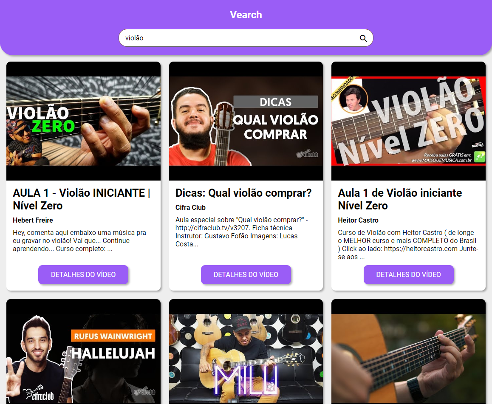

<h3 align="center">Vearch - Vídeo search</h3>

<div align="center">

[]()
[](https://github.com/niltonslf/youtube-challenge-front-end/issues)
[](https://github.com/niltonslf/youtube-challenge-front-end/pulls)
[](/LICENSE)

</div>

---

<p align="center"> Aplicação desenvolvida para consumir a api do youtube.
    <br> 
</p>


## 📝 Table of Contents

- [About](#about)
- [Deployment](#deployment)
- [Built Using](#built_using)
- [Authors](#authors)

## 🧐 About <a name = "about"></a>

Vearch (video + search) is a reacjs app developed as a Front End vacancy Challenge.

[See demo version](https://vearch.netlify.com/)

## 📷 Screensot



## 🚀 Deployment <a name = "deployment"></a>


### Prerequisites

You will need to have ```yarn``` or ```npm``` installed.

### Running as development

1. inside project folder run: 
    ```
    yarn install
    or
    npm install
    ```
2. duplicate .env.production file and renames to .env.local
3. Add youtube api key to variable REACT_APP_YT_KEY. You can generate one [here](https://developers.google.com/youtube/v3/getting-started?hl=pt-br)
4. It's done! Now you can run the following command to start development server:
      ```
        yarn start
        or
        npm run start
      ```


### Running as production

To production version ignore step 2 and change step 4 with: ``yarn build `` instead ``yarn start``. 


## 🔧 Running the tests <a name = "tests"></a>

  Nothing here yet 😭


## ⛏️ Built Using <a name = "built_using"></a>

- [Reactjs](https://pt-br.reactjs.org/) - Front-end library
- [axios](https://github.com/axios/axios) - HTTP Requests
- [Youtube](https://developers.google.com/youtube/v3) - Youtube v3 API


## ✍️ Authors <a name = "authors"></a>

- [@niltonslf](https://github.com/niltonslf) - Developer
